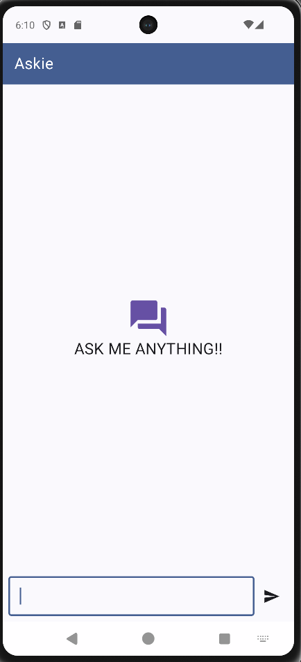
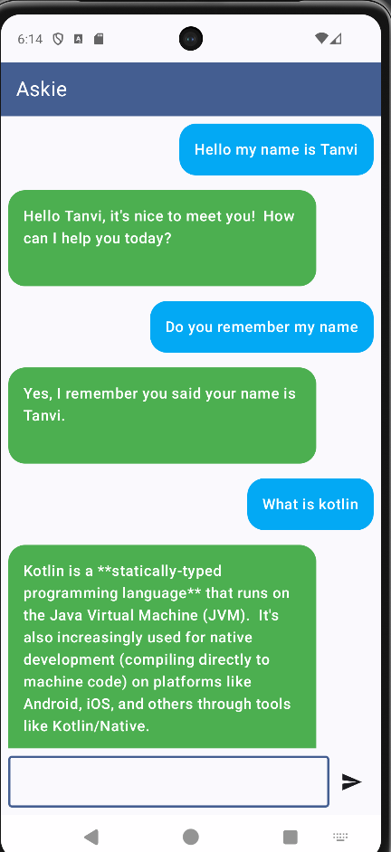
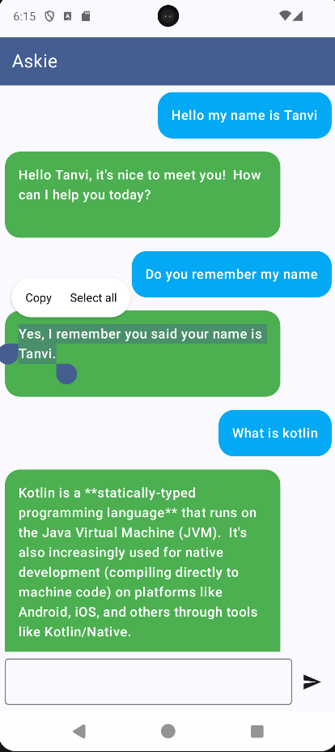

# 🤖 Askie – AI Chatbot App

Askie is an Android chatbot application built using **Kotlin**, **Jetpack Compose**, and **Google Gemini API**.  
It provides a smooth, modern chat UI and interacts with Google’s Generative AI to answer your questions instantly.

---

## ✨ Features
- 📡 **Powered by Google Gemini API** – Uses `gemini-1.5-flash` model for quick responses.
- 🎨 **Modern Jetpack Compose UI** – Clean, minimal, and responsive design.
- 💬 **Two-sided chat bubbles** – User and AI messages are styled differently.
- ⚡ **Instant Responses** – Uses coroutines & ViewModel for smooth async operations.
- 📂 **State Management** – Managed with `mutableStateListOf` for real-time UI updates.
- 📸 **Screenshots** – See below for previews.

---

## 📱 Screenshots

| Home Screen | Conversation View | AI Response |
|-------------|-------------------|-------------|
|  |  |  |

## 🛠️ Tech Stack
- **Language**: Kotlin
- **UI**: Jetpack Compose
- **Architecture**: MVVM (Model-View-ViewModel)
- **AI Model**: Google Gemini (`gemini-1.5-flash`)
- **Coroutines**: For background threading
- **Git & GitHub**: Version control

---

## 🚀 How It Works
1. User types a question.
2. ViewModel sends the request to the Gemini model.
3. Gemini responds with AI-generated text.
4. The response is added to the chat list & displayed in the UI.
